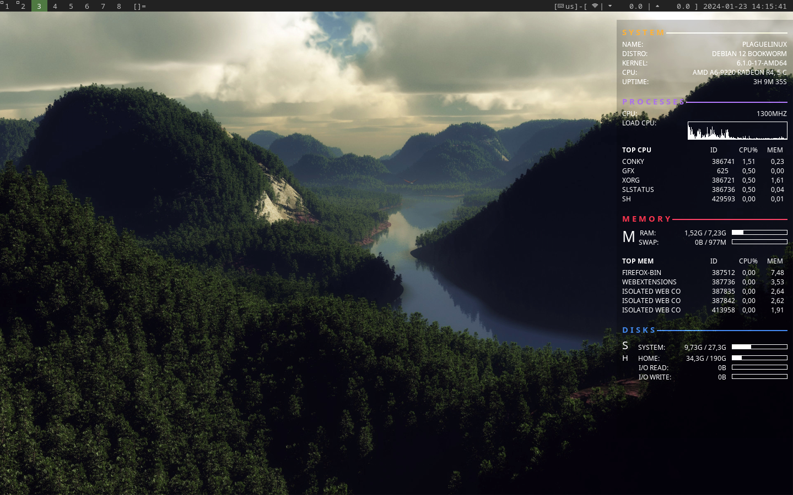

# LinuxApp

My pack of applications and dotfiles which I use on Linux

Recently I have been using Linux. And now my main system is Linux. Now I want to put together a package of the best applications for work and life on Linux OS 

### Distro now: [ Debian](https://debian.org/)

## Music

- [ Yandex.Music](https://www.music.yandex.com) - Streaming service for music for all your devices

## Messengers
- [ Telegram](https://desktop.telegram.org/) - The messaging app with a focus on speed and security, it’s super fast, simple and free.
- [ Discord](https://discordapp.com) - Discord is a free voice and text chat client for gamers and non-gamers alike. You can use it from your browser and it's available on iOS, Android, Windows, Mac, and Linux.

## Games
- [ Steam](https://store.steampowered.com/)

## Code editor
- [ Visual Studio Code](https://code.visualstudio.com/) - Lightweight Source Code Editor and text as well
Essential tools for software developers and teams

## Video/Graphics/3D editors
- [ Krita](https://krita.org/)  - Krita is a professional free and open source painting program.
- [ Inkscape](https://inkscape.org/)  - Free and open-source vector graphics editor
- [ Blender](https://www.blender.org/) - Fully-featured extensible cross-platform 3D content suite.

## Docs
- [ Google Docs](https://www.google.com/docs) Web docs, I use every day.
